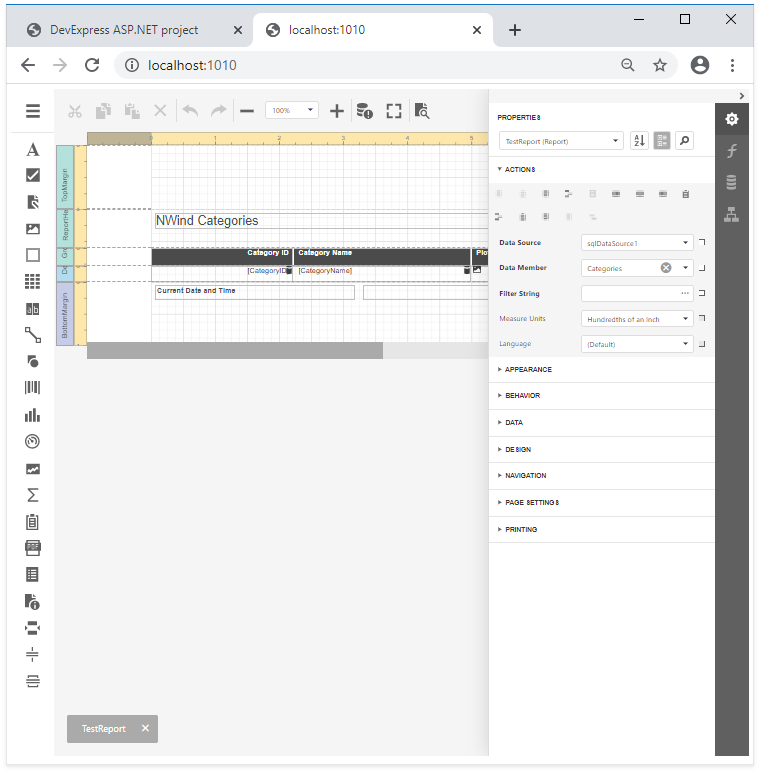

<!-- default badges list -->

[](https://supportcenter.devexpress.com/ticket/details/T848275)
[](https://docs.devexpress.com/GeneralInformation/403183)
[](#does-this-example-address-your-development-requirementsobjectives)
<!-- default badges end -->
# Reporting for JavaScript - Integrate the Web Report Designer (with npm or Yarn package managers)

This example demonstrates how to integrate the [End-User Web Report Designer](https://docs.devexpress.com/XtraReports/17103) in JavaScript application based on the server-side model.



This example consists of two parts: 

- A server (back-end) ASP.NET Core project that enables [cross-domain requests (CORS)](https://developer.mozilla.org/en-US/docs/Web/HTTP/CORS) (Access-Control-Allow-Origin) and implements a custom web report storage.

- A front-end client JavaScript application with the Web Report Designer control.

steps to run this example:

1. Run the *ServerApp* project.
2. Navigate to the *ClientSide* folder and run the following command to install packages:
    - If you have the **npm** package manager:

        ```npm install```
    - If you have the **Yarn** package manager:
        
        ```yarn install```    

4. Host the client-side part (the *ClientSide** folder) on the web server. You can add a new web site in the **Internet Information Services (IIS) Manager**.
5. Launch the browser and open the web site created in the previous step.


## Documentation

* [Report Designer Integration (npm or Yarn Package Managers)
](https://docs.devexpress.com/XtraReports/401256/web-reporting/knockout-reporting/report-designer/report-designer-integration-with-npm-yarn)
<!-- feedback -->
## Does This Example Address Your Development Requirements/Objectives?

[](https://www.devexpress.com/support/examples/survey.xml?utm_source=github&utm_campaign=reporting-basic-designer-javascript-integration&~~~was_helpful=yes) [](https://www.devexpress.com/support/examples/survey.xml?utm_source=github&utm_campaign=reporting-basic-designer-javascript-integration&~~~was_helpful=no)

(you will be redirected to DevExpress.com to submit your response)
<!-- feedback end -->
