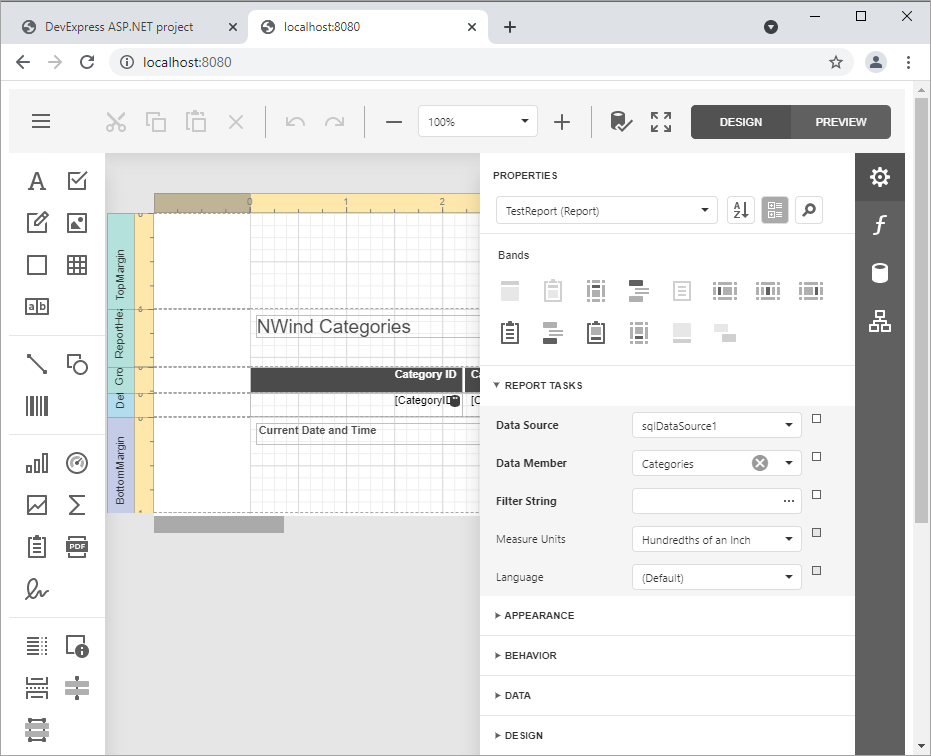

<!-- default badges list -->

[](https://supportcenter.devexpress.com/ticket/details/T848275)
[](https://docs.devexpress.com/GeneralInformation/403183)
<!-- default badges end -->
<!-- default file list -->
*Files to look at*:
* [ReportDesignerController.cs](./CS/DXWebApplication1/Controllers/ReportDesignerController.cs) (VB: [ReportDesignerController.vb](./VB/DXWebApplication1/Controllers/ReportDesignerController.vb))
* [WebDocumentViewerController.cs](./CS/DXWebApplication1/Controllers/WebDocumentViewerController.cs) (VB: [WebDocumentViewerController.vb](./VB/DXWebApplication1/Controllers/WebDocumentViewerController.vb))
* [QueryBuilderController.cs](./CS/DXWebApplication1/Controllers/QueryBuilderController.cs) (VB: [QueryBuilderController.vb](./VB/DXWebApplication1/Controllers/QueryBuilderController.vb))
* [package.json](./JS/ClientSide/package.json)
* [example.js](./JS/ClientSide/example.js)
* [index.html](./JS/ClientSide/index.html)
<!-- default file list end -->

# How to Perform the JavaScript Report Designer Integration (with npm or Yarn package managers)

This example demonstrates how to integrate the [End-User Web Report Designer](https://docs.devexpress.com/XtraReports/17103) in JavaScript application based on the server-side model.

This example is created by performing the steps described in the [Basic Report Designer Integration (with npm or Yarn package managers)](https://docs.devexpress.com/XtraReports/401256) document.

This example consists of two parts: 

- A server (back-end) ASP.NET MVC project that enables [cross-domain requests (CORS)](https://developer.mozilla.org/en-US/docs/Web/HTTP/CORS) (Access-Control-Allow-Origin) and implements a custom web report storage.

- Report Designer front-end client JavaScript application.

Perform the following steps to run this example:

1. Open the back-end project solution (**CS\DXWebApplication1.sln** or **VB\DXWebApplication1.sln**) in Visual Studio and run the project.
2. Navigate to the **JS\ClientSide** folder that is the client part's root folder.
3. Open the console and run the following command:
    - if you have the **npm** package manager:

        ```npm install```
    - if you have the **Yarn** package manager:
        
        ```yarn install```    

4. Host the client-side part ( **JS\ClientSide** folder ) on the web server. You can add a new web site in the **Internet Information Services (IIS) Manager**.
5. Launch the browser and open the web site created in the previous step.

    
